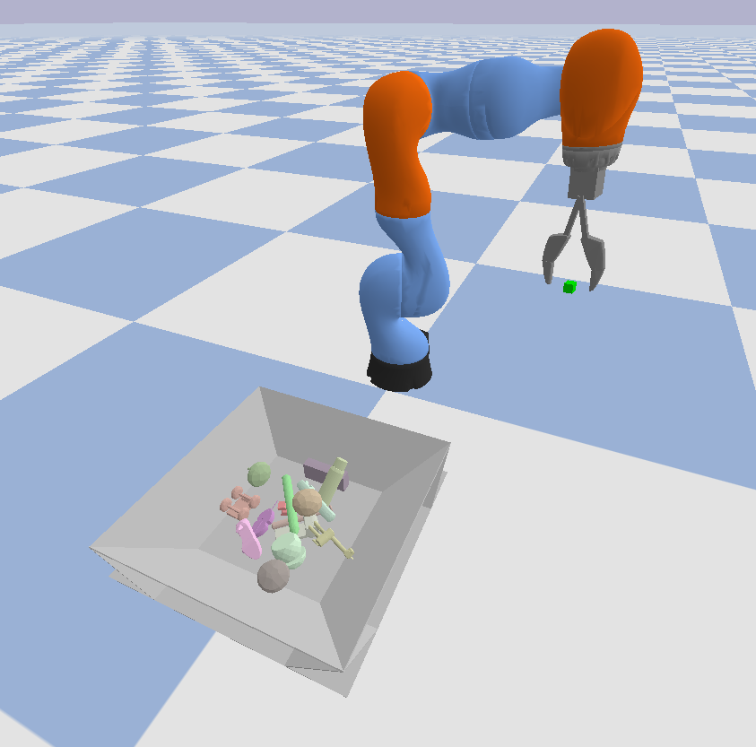
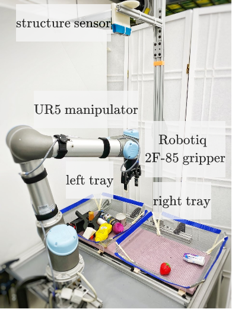
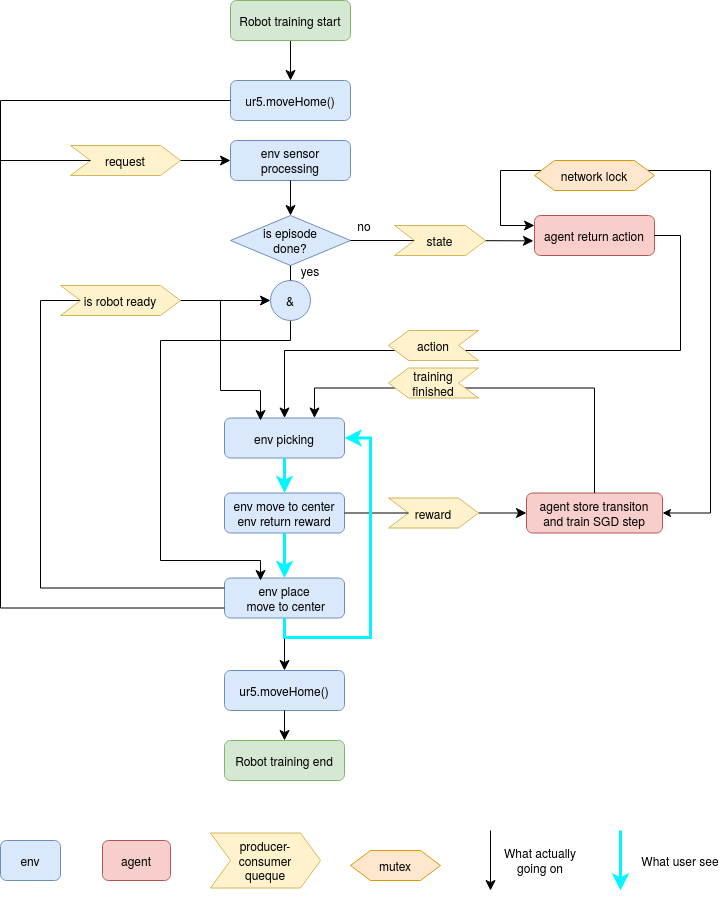

# Sample Efficient Grasp Learning Using Equivariant Models

**Abstract**

In planar grasp detection, the goal is to learn a function from an image of a scene onto a set of feasible grasp poses
in SE(2). In this paper, we recognize that the optimal grasp function is SE(2)-equivariant and can be modeled
using an equivariant convolutional neural network. As a result, we are able to significantly improve the sample
efficiency of grasp learning, obtaining a good approximation of the grasp function after only 600 grasp attempts. This
is few enough that we can learn to grasp completely on a physical robot in about 1.5 hours.

<center>
<a href="https://arxiv.org/abs/2202.09468">Paper</a> &emsp;&emsp;&emsp;
<a href="https://zxp-s-works.github.io/equivariant_grasp_site/">Website</a> &emsp;&emsp;&emsp;
</center>


**Citation**

```
@misc{zhu2022sample,
      title={Sample Efficient Grasp Learning Using Equivariant Models}, 
      author={Xupeng Zhu and Dian Wang and Ondrej Biza and Guanang Su and Robin Walters and Robert Platt},
      year={2022},
      eprint={2202.09468},
      archivePrefix={arXiv},
      primaryClass={cs.RO}
}
```


## Environments

### Simulation Environment

<table border="0">
 <tr>
    <td>The simulation environment is random_household_picking_clutter_full_obs_30. This environment is implemented in /helping_hands_rl_envs/envs/pybullet_envs.
</td>
    <td><p align="center">

</p></td>
 </tr>
</table>


### Physical Environment


<table border="0">
 <tr>
    <td>The physical robot environment is DualBinFrontRear. To train on this environment, a physical robot set up is required.
</td>
    <td><p align="center">

</p></td>
 </tr>
</table>


## Installation


1. Install [anaconda](https://docs.conda.io/projects/conda/en/latest/user-guide/install/)
1. Create and activate a conda virtual environment with python3.7.
    ```
    sudo apt update
    conda create -n eqvar_grasp python=3.7
    conda activate eqvar_grasp
    ```
1. Download the git repository and checkout "with_supervised_learning" branch.
    ```
    git clone https://github.com/ZXP-S-works/asrse3.git -b with_supervised_learning
    cd asrse3
    ```
1. Install [PyTorch](https://pytorch.org/) (Recommended: pytorch==1.8.1, torchvision==0.9.1)
1. Install [CuPy](https://github.com/cupy/cupy)
1. Install other requirement packages
    ```
    pip install -r requirements.txt
    ```
1. Clone and install the environment repo 
    ```
    git clone https://github.com/ColinKohler/helping_hands_rl_envs.git -b xupeng_realistic
    cd helping_hands_rl_envs
    pip install -r requirements.txt
    cd ..
    ```
1. Go to the scripts folder of this repo to run experiments
    ```
    cd asrse3/scripts
    ```

## Reinforcement learning


### Training baselines in simulation

Our method
```bash
python3 ./scripts/main.py 
```

To visualize the simulation and the policy learning, set --render=f.

Default parameters:
```
--env=random_household_picking_clutter_full_obs_30
--num_processes=1
--eval_num_processes=10
--render=f # set it to True to see the actual simulation & training process
--learning_curve_avg_window=50
--training_offset=20
--target_update_freq=20
--q1_failure_td_target=non_action_max_q2
--q1_success_td_target=rewards
--alg=dqn_asr
--model=equ_resu_nodf_flip_softmax
--q2_train_q1=Boltzmann10
--q2_model=equ_shift_reg_7_lq_softmax_last_no_maxpool32
--q2_input=hm_minus_z
--q3_input=hm_minus_z
--patch_size=32 
--batch_size=8
--max_episode=1500
--explore=500
--action_selection=Boltzmann
--hm_threshold=0.005
--step_eps=0
--init_eps=0.
--final_eps=0. 
--log_pre=../results/household_repo/rand_household_picking_clutter/ 
--sample_onpolicydata=t 
--onlyfailure=t 
--num_rotations=8 
--aug=0
--onpolicy_data_aug_n=8 
--onpolicy_data_aug_flip=True 
--onpolicy_data_aug_rotate=True 
--num_eval_episodes=1000
```

### Real-time training in a physical robot
The parallel training is only implemented in physical robot environment. However, one can easily modify it to any environment.

```
??? python3 ./scripts/train_robot_parallel.py --env=DualBinFrontRear --hm_threshold=0.015 --step_eps=20 --init_eps=1. --final_eps=0.
```

<table border="0">
 <tr>
    <td>The right figure illustrates the parallel training.
</td>
    <td><p align="center">

</p></td>
 </tr>
</table>


